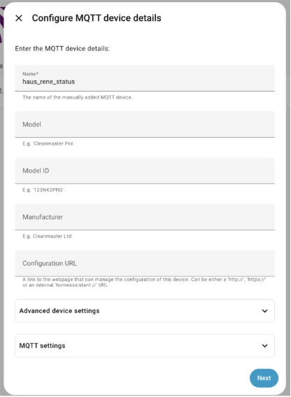
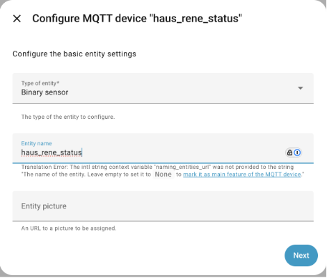
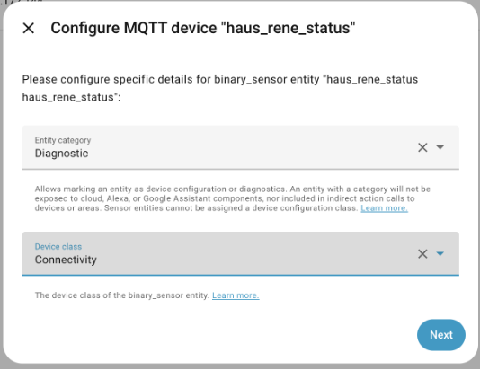
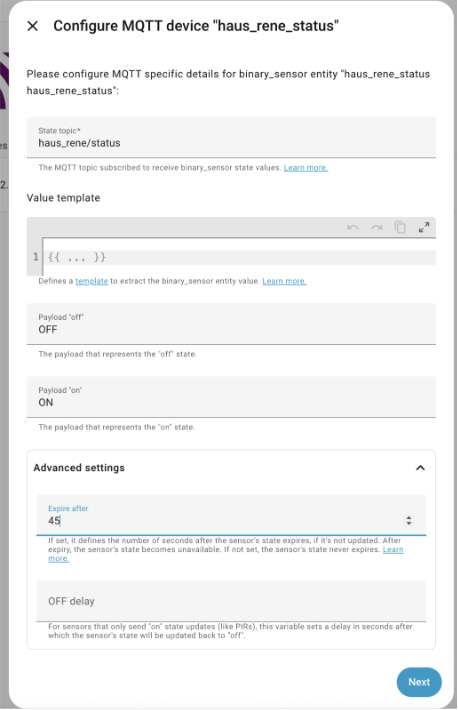
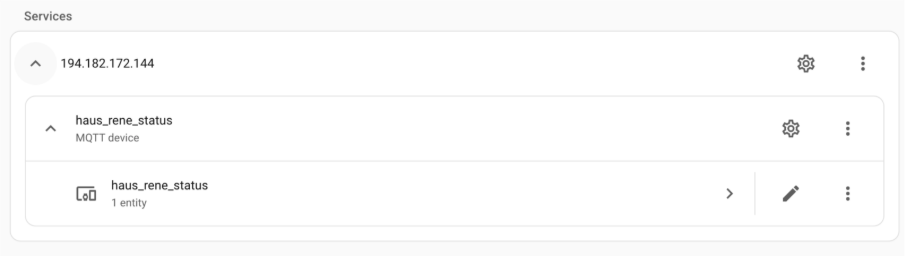

# Homeassistant Setup

Im folgenden wird die grundlegende Einrichtung von Home Assistant für dieses Projekt beschrieben. Der Fokus liegt auf der Verwendung von Helpern zur Steuerung interner Logik sowie auf der Anbindung über MQTT zur Kommunikation mit externen Systemen und anderen Home-Assistant-Instanzen. Sämtliche **yaml**-Konfigurationsfiles sind im Repository zu finden.

## Helper erstellen

Helper (Hilfsentitäten) in Home Assistant werden verwendet, um Zustände, Werte oder Auswahlmöglichkeiten für Automationen, Skripte und Dashboards bereitzustellen.

### Anleitung

1. Home-Assistant-Weboberfläche öffnen
2. Klicke in der linken Seitenleiste auf **Settings**.
3. Wähle **Devices & Services**.
4. Wechsle oben auf den Reiter **Helpers**.
5. Klicke unten rechts auf **+ CREATE HELPER**.
6. Wähle den gewünschten Helper-Typ aus.
7. Vergib einen **Name** und passe die Einstellungen an.
8. Klicke auf **Create**, um den Helper anzulegen.

### Verwendung

Nach dem Erstellen steht der Helper als **Entity** zur Verfügung und kann in **Automations**, **Scripts**, **Dashboards (Lovelace)** und **Templates** verwendet werden.

### In diesem Setup verwendete Helper

In diesem Home-Assistant-Setup wurden folgende Helper angelegt:

- **aussen_temperatur**  
  Typ: **Number Helper**  
  Beschreibung: Diese Variable speichert eine simulierte Außentemperatur und kann z. B. für Tests, Simulationen oder Automationen ohne echten Temperatursensor verwendet werden.

- **mqtt_marco**  
  Typ: **Toggle (Boolean Helper)**  
  Beschreibung: Wird verwendet, um dieses System von Marcos MQTT zu entkoppeln. Ist der Helper aktiviert, wird die MQTT-Kommunikation mit Marco entsprechend unterbunden.

- **mqtt_marcus**  
  Typ: **Toggle (Boolean Helper)**  
  Beschreibung: Wird verwendet, um dieses System von Marcus’ MQTT zu entkoppeln. Ist der Helper aktiviert, wird die MQTT-Kommunikation mit Marcus entsprechend unterbunden.

- **mqtt_rene**  
  Typ: **Toggle (Boolean Helper)**  
  Beschreibung: Wird verwendet, um dieses System von Renes MQTT zu entkoppeln. Ist der Helper aktiviert, wird die MQTT-Kommunikation mit Rene entsprechend unterbunden.

## MQTT Setup

In diesem Kapitel wird beschrieben, wie MQTT in Home Assistant eingerichtet wird. MQTT wird häufig genutzt, um Daten zwischen verschiedenen Systemen, Sensoren oder anderen Home-Assistant-Instanzen auszutauschen.

---

### 1. MQTT-Integration hinzufügen

1. Öffne die Home-Assistant-Weboberfläche.
2. Klicke in der linken Seitenleiste auf **Settings**.
3. Wähle **Devices & Services**.
4. Klicke unten rechts auf **+ ADD INTEGRATION**.
5. Suche nach **MQTT** und wähle die Integration aus.

---

### 2. MQTT-Broker konfigurieren

1. Trage die **Broker-Adresse** (IP oder Hostname) ein.
2. Passe bei Bedarf den **Port** an (Standard: `1883`).
3. Eintragen von **Username** und **Password**.
4. Klicke auf **Submit**.

### 3. MQTT Entities für Hausstatus (Heartbeat)

Um den Verbindungsstatus anderer Häuser zu visualisieren, werden dedizierte MQTT-Entities angelegt. Diese werden regelmäßig über einen Heartbeat aktualisiert.

#### Vorgehen

Für jedes Haus wird ein eigenes MQTT Device angelegt.

1. Gehe zu **Settings → Devices & Services → MQTT**.
2. Füge ein neues **MQTT Device** hinzu.
3. Vergib folgenden Namen: **haus_<rene|marco|marcus>_status**

4. Konfiguriere das Device so, dass es den Heartbeat (z. B. Online/Offline oder Zeitstempel) über ein definiertes MQTT-Topic empfängt.

5. Wiederhole diesen Vorgang für alle drei Häuser:
- `haus_rene_status`
- `haus_marco_status`
- `haus_marcus_status`

Anschließend sollte das Ergebnis wie folgt aussehen:

